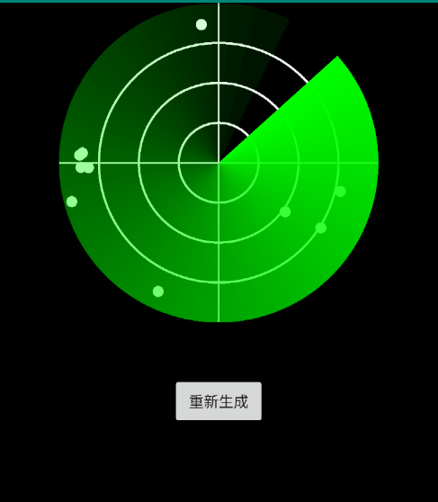

# 雷达扫描效果
 截图(gif效果没法看)



在xml中使用：

```
<cn.infinite.radarapplication.RadarView
        android:id="@+id/radarView"
        android:layout_width="match_parent"
        android:layout_height="300dp"
        app:sweepColor="#00ff00"
        app:circleColor="#ffffff"
        app:circleCount="3"
        app:circleWidth="2dp"
        app:axisColor="#ffffff"
        app:axisWidth="10dp"
        app:spotCount="5"
        app:spotColor="#ffffff"
        app:radarBackground="@android:color/black"
        app:spotRadius="5dp"/>
```

属性:

|属性名|含义|
| ------------- |:-------------|
|sweepColor|扫描区域的颜色(从设置的颜色渐变到透明)|
|circleColor|圆圈的颜色|
|circleCount|圆圈数量|
|circleWidth|圆圈线的宽度|
|axisColor|十字坐标轴的颜色|
|axisWidth|十字坐标轴线宽|
|spotCount|扫面出点的数量|
|spotColor|点的颜色|
|spotRadius|点的半径|
|radarBackground|雷达区域的背景色|

相关属性在代码中也可以设置
